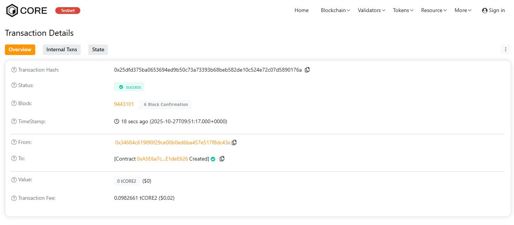

# EtherCore Protocol

## Project Description

EtherCore Protocol is a decentralized smart contract system built on the Ethereum blockchain that provides secure, transparent, and efficient mechanisms for value storage and transfer. The protocol enables users to deposit Ether, manage their balances, withdraw funds, and transfer assets to other users within the ecosystem—all without intermediaries.

Built with security and user experience in mind, EtherCore Protocol leverages Solidity's robust features to ensure safe fund management while maintaining complete transparency through on-chain events and public state tracking.

## Project Vision

Our vision is to create a foundational layer for decentralized finance (DeFi) that prioritizes:

- **Security First**: Implementing best practices in smart contract development to protect user funds
- **Transparency**: All transactions and balances are publicly verifiable on the blockchain
- **Accessibility**: Providing a simple, user-friendly interface for blockchain interactions
- **Decentralization**: Eliminating intermediaries and giving users full control over their assets
- **Scalability**: Building a protocol that can serve as the foundation for more complex DeFi applications

EtherCore Protocol aims to be the core infrastructure that developers and users can trust for building and using decentralized financial applications.

## Key Features

### 1. **Secure Deposit System**
- Users can deposit ETH into the protocol with complete security
- Automatic balance tracking for each user
- Real-time event emission for transparency
- Support for direct ETH transfers through receive/fallback functions

### 2. **Flexible Withdrawal Mechanism**
- Withdraw deposited funds at any time
- Built-in balance validation to prevent errors
- Secure transfer of funds back to user wallets
- Protection against insufficient balance scenarios

### 3. **Peer-to-Peer Transfer**
- Transfer funds between users within the protocol instantly
- No gas costs for recipient
- Maintains protocol efficiency by keeping funds on-chain
- Comprehensive validation for secure transfers

### 4. **Transparent Tracking**
- Public view functions to check any user's balance
- Total deposits and contract balance visibility
- Event logs for all major actions (deposits, withdrawals, transfers)
- Complete audit trail for accountability

### 5. **Safety Features**
- Owner-controlled emergency withdrawal function
- Comprehensive require statements for input validation
- Custom modifiers for access control
- Protection against common vulnerabilities

## Future Scope

### Phase 1: Enhanced Features
- **Interest Mechanism**: Implement yield generation for deposited funds
- **Staking System**: Allow users to stake tokens for rewards
- **Multi-token Support**: Extend beyond ETH to support ERC-20 tokens
- **Tiered Accounts**: Introduce account levels with different benefits

### Phase 2: Advanced Functionality
- **Lending Protocol**: Enable users to lend and borrow assets
- **Liquidity Pools**: Create automated market maker (AMM) functionality
- **Governance Token**: Launch protocol governance with voting rights
- **Flash Loans**: Implement uncollateralized loan mechanisms

### Phase 3: Ecosystem Expansion
- **Cross-chain Bridge**: Enable asset transfers across different blockchains
- **Mobile Application**: Develop native mobile apps for iOS and Android
- **DeFi Aggregator**: Integrate with other DeFi protocols for maximum yield
- **Insurance Fund**: Create a community-driven insurance mechanism

### Phase 4: Enterprise Solutions
- **API Integration**: Provide REST APIs for third-party integrations
- **White-label Solutions**: Offer customizable versions for businesses
- **Institutional Features**: Add KYC/AML compliance options for enterprises
- **Advanced Analytics**: Build comprehensive dashboards and reporting tools

### Technical Improvements
- Gas optimization through advanced Solidity patterns
- Layer 2 scaling solutions integration (Polygon, Arbitrum, Optimism)
- Formal verification of smart contracts
- Upgradeable contract architecture using proxy patterns
- Integration with decentralized oracles for price feeds

---

## Installation & Deployment

### Prerequisites
```bash
Node.js >= 16.0.0
npm or yarn
Hardhat or Truffle framework
MetaMask or similar Web3 wallet
```

### Setup
```bash
# Clone the repository
git clone https://github.com/yourusername/EtherCore-Protocol.git
cd EtherCore-Protocol

# Install dependencies
npm install

# Compile contracts
npx hardhat compile

# Run tests
npx hardhat test

# Deploy to local network
npx hardhat run scripts/deploy.js --network localhost

# Deploy to testnet (Sepolia)
npx hardhat run scripts/deploy.js --network sepolia
```

## Usage

### Deploying the Contract
```javascript
const Project = await ethers.getContractFactory("Project");
const project = await Project.deploy();
await project.deployed();
console.log("EtherCore Protocol deployed to:", project.address);
```

### Interacting with the Contract
```javascript
// Deposit ETH
await project.deposit({ value: ethers.utils.parseEther("1.0") });

// Check balance
const balance = await project.getMyBalance();

// Withdraw funds
await project.withdraw(ethers.utils.parseEther("0.5"));

// Transfer to another user
await project.transferFunds(recipientAddress, ethers.utils.parseEther("0.3"));
```

## Security Considerations

- All functions include comprehensive input validation
- Reentrancy protection through checks-effects-interactions pattern
- Access control via modifiers
- Event emission for transparency
- Regular security audits recommended before mainnet deployment

## License

This project is licensed under the MIT License - see the LICENSE file for details.

## Contributing

We welcome contributions! Please read our contributing guidelines and submit pull requests to our repository.

## Contact

- **Website**: https://ethercoreprotocol.io
- **Twitter**: @EtherCoreProtocol
- **Discord**: discord.gg/ethercoreprotocol
- **Email**: team@ethercoreprotocol.io

---

**Built with ❤️ by the EtherCore Team**

*Empowering the decentralized future, one block at a time.*

H address:0x25dfd375ba0653694ed9b50c73a73393b68beb582de10c524e72c07d5890176a


